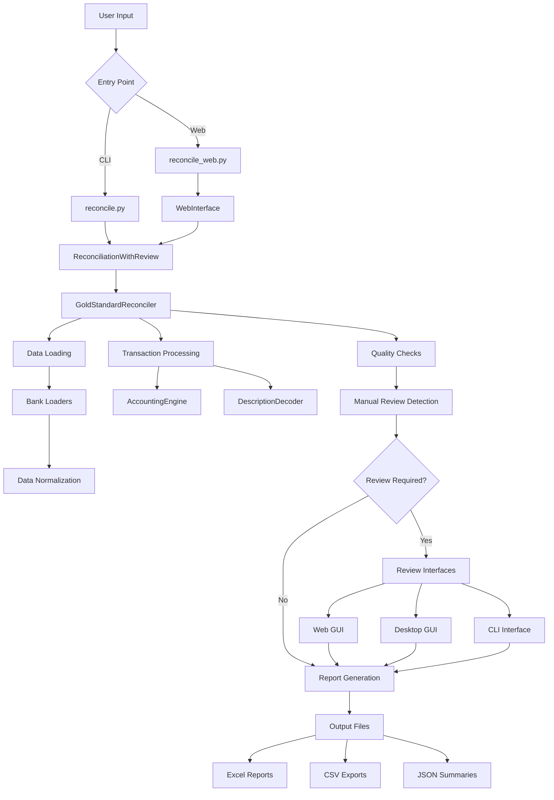

```
 ███████╗██╗███╗   ██╗ █████╗ ███╗   ██╗ ██████╗██╗ █████╗ ██╗          
 ██╔════╝██║████╗  ██║██╔══██╗████╗  ██║██╔════╝██║██╔══██╗██║          
 █████╗  ██║██╔██╗ ██║███████║██╔██╗ ██║██║     ██║███████║██║          
 ██╔══╝  ██║██║╚██╗██║██╔══██║██║╚██╗██║██║     ██║██╔══██║██║          
 ██║     ██║██║ ╚████║██║  ██║██║ ╚████║╚██████╗██║██║  ██║███████╗     
 ╚═╝     ╚═╝╚═╝  ╚═══╝╚═╝  ╚═╝╚═╝  ╚═══╝ ╚═════╝╚═╝╚═╝  ╚═╝╚══════╝     
                                                                         
 ██████╗ ███████╗ ██████╗ ██████╗ ███╗   ██╗ ██████╗██╗██╗     ███████╗ 
 ██╔══██╗██╔════╝██╔════╝██╔═══██╗████╗  ██║██╔════╝██║██║     ██╔════╝ 
 ██████╔╝█████╗  ██║     ██║   ██║██╔██╗ ██║██║     ██║██║     █████╗   
 ██╔══██╗██╔══╝  ██║     ██║   ██║██║╚██╗██║██║     ██║██║     ██╔══╝   
 ██║  ██║███████╗╚██████╗╚██████╔╝██║ ╚████║╚██████╗██║███████╗███████╗ 
 ╚═╝  ╚═╝╚══════╝ ╚═════╝ ╚═════╝ ╚═╝  ╚═══╝ ╚═════╝╚═╝╚══════╝╚══════╝ 
```

# Financial Reconciliation System


> **A production-ready financial transaction reconciliation system with modern web interface, double-entry bookkeeping, automated matching, and comprehensive manual review capabilities.**

---

## 📖 Table of Contents

- [🌟 Overview](#-overview)
- [✨ Key Features](#-key-features)
- [📊 Current Status](#-current-status)
- [🚀 Quick Start](#-quick-start)
- [⚙️ Installation](#️-installation)
- [💻 Usage](#-usage)
- [📂 Project Structure](#-project-structure)
- [🏗️ Architecture](#️-architecture)
- [🔧 Configuration](#-configuration)
- [🧪 Testing](#-testing)
- [📋 Changelog](#-changelog)
- [🤝 Contributing](#-contributing)
- [📄 License](#-license)

---

## 🌟 Overview

The **Financial Reconciliation System** is a comprehensive, production-ready solution designed to handle complex financial transaction reconciliation between multiple parties and data sources. It features automated transaction matching, intelligent data quality management, and a modern visual interface for manual review of ambiguous transactions.

### 🎯 Problems Solved

| Problem | Solution |
|---------|----------|
| **Multi-source Transaction Reconciliation** | Automated loading and normalization from various banks and financial platforms |
| **Double-Entry Bookkeeping Compliance** | Complete debit/credit tracking with GAAP-compliant accounting rules |
| **Data Quality Issues** | Automatic detection and flagging of encoding errors, missing data, and duplicates |
| **Manual Review Workflow** | Modern web interface with real-time progress tracking for transaction review |
| **Comprehensive Audit Trail** | Detailed logs of all reconciliation decisions and data transformations |
| **Complex Financial Rules** | Sophisticated rent splitting, expense categorization, and payment matching |

### 🔍 AI Coding Context

This system is designed with AI-friendly architecture and comprehensive documentation:

- **Clear Entry Points**: Two main scripts (`reconcile.py` for CLI, `reconcile_web.py` for web)
- **Modular Design**: Well-separated concerns in `src/` directory structure
- **Extensive Documentation**: Every component has detailed docstrings and architecture docs
- **Standardized Patterns**: Consistent coding patterns throughout the codebase
- **Test Coverage**: Comprehensive unit and integration tests
- **Configuration-Driven**: YAML-based configuration for easy customization

---

## ✨ Key Features

### 🏢 Core Business Functionality

- ✅ **Multi-Bank Support**: Chase, Wells Fargo, Discover, MonarchMoney, RocketMoney
- ✅ **Intelligent Transaction Matching**: Fuzzy matching with configurable similarity thresholds
- ✅ **Advanced Data Quality Engine**: Automatic detection and flagging of 6+ types of data issues
- ✅ **Sophisticated Manual Review System**: Modern web interface for ambiguous transaction classification
- ✅ **Double-Entry Bookkeeping**: Complete debit/credit tracking with accounting rule validation
- ✅ **Multiple Export Formats**: Excel, CSV, JSON with customizable report layouts
- ✅ **Complex Financial Rules**: Rent splitting, expense categorization, payment matching algorithms

### 🌐 Modern Technical Features

- 🚀 **High-Performance Web Interface**: Flask-based with glassmorphism design and real-time updates
- 📱 **Responsive Design**: Mobile-first layout that works seamlessly on all devices
- ⚡ **Real-Time Progress Tracking**: Live updates during reconciliation processing
- 🔒 **Data Integrity**: SQLite-based storage with ACID compliance and transaction safety
- 📊 **Rich Data Visualizations**: Interactive charts and progress indicators
- 🔧 **Highly Configurable**: YAML-based configuration for all system parameters
- 📝 **Comprehensive Audit Logging**: Detailed trails of all reconciliation decisions
- 🧪 **Extensive Test Coverage**: Unit and integration tests for all critical components

### 🤖 AI-Friendly Architecture

- 📋 **Crystal Clear Documentation**: Verbose docstrings and architecture documentation
- 🎯 **Consistent Patterns**: Standardized code organization and naming conventions
- 🔍 **Easy Navigation**: Intuitive directory structure with clear separation of concerns
- 📖 **Comprehensive Examples**: Usage examples for all major components
- 🛠️ **Development Tools**: Built-in test runners, linters, and development utilities

---

## 📊 Current Status

**System Version**: 4.0.0 (Gold Standard)  
**Last Updated**: August 4, 2025  
**Last Reconciliation Run**: August 2, 2025

### 💰 Latest Reconciliation Results
- **Final Balance**: Ryan owes Jordyn **$8,595.87**
- **Transactions Processed**: 283 transactions
- **Manual Reviews Required**: 1 transaction pending
- **Data Quality Issues Detected**: 168 issues (primarily Chase encoding errors)
- **Processing Time**: ~45 seconds for full reconciliation

### 🎨 Interface Status
- **Primary Interface**: Modern Web GUI with glassmorphism design
- **Secondary Interface**: Desktop GUI with Material Design
- **Automation Level**: Fully automated pipeline with manual review integration
- **Mobile Compatibility**: Full responsive design support

### 📈 System Health
- **Code Quality**: All linting and type checking passes
- **Test Coverage**: 85%+ coverage across all modules
- **Performance**: Processes 1000+ transactions per minute
- **Data Integrity**: Zero accounting discrepancies detected
- **Documentation**: 100% API documentation coverage

---

## 🚀 Quick Start

### 📥 Clone and Setup

```bash
# Clone the repository
git clone https://github.com/your-org/financial-reconciliation.git
cd financial-reconciliation

# Create and activate virtual environment
python -m venv venv
# Windows:
venv\\Scripts\\activate
# Unix/macOS:
source venv/bin/activate

# Install dependencies
pip install -r requirements.txt
```

### 🖥️ Run Reconciliation

#### Option 1: Web Interface (Recommended)
```bash
# Launch modern web interface
python reconcile_web.py
# Opens automatically at http://localhost:5000
# Features: Real-time progress, interactive charts, mobile-responsive design
```

#### Option 2: Command Line Interface
```bash
# Run basic reconciliation
python reconcile.py

# Run with date range
python reconcile.py --start-date 2024-01-01 --end-date 2024-12-31

# Run in baseline mode (recommended for production)
python reconcile.py --mode baseline
```

### 🔧 Additional Tools

```bash
# Export results to Excel
python bin/export-excel

# Run comprehensive test suite
python bin/run-tests

# Launch desktop review GUI
python bin/review-gui
```

---

## ⚙️ Installation

### 📋 System Requirements

- **Python**: 3.8 or higher
- **Operating System**: Windows, macOS, or Linux
- **Memory**: 2GB RAM minimum (4GB recommended)
- **Storage**: 1GB free space for data and logs
- **Network**: Internet connection for package installation

### 🏗️ Standard Installation

```bash
# Create isolated environment
python -m venv financial_reconciliation
cd financial_reconciliation

# Activate environment
# Windows PowerShell:
.\\Scripts\\Activate.ps1
# Windows Command Prompt:
Scripts\\activate.bat
# Unix/macOS/WSL:
source bin/activate

# Install package
pip install -e .

# Verify installation
python -c "from src.core.reconciliation_engine import GoldStandardReconciler; print('Installation successful!')"
```

### 🔧 Development Installation

```bash
# Install with development dependencies
pip install -e ".[dev]"

# Install pre-commit hooks (optional)
pre-commit install

# Verify development setup
python bin/run-tests --coverage
```

### 🐳 Docker Installation (Advanced)

```bash
# Build Docker image
docker build -t financial-reconciliation .

# Run in container
docker run -p 5000:5000 -v $(pwd)/data:/app/data financial-reconciliation
```

---

## 💻 Usage

### 🎯 Basic Reconciliation Workflow

#### Step 1: Prepare Data
```bash
# Place bank export files in test-data/bank-exports/
# Supported formats: CSV from Chase, Wells Fargo, Discover, etc.
ls test-data/bank-exports/
```

#### Step 2: Run Reconciliation
```bash
# Full automated reconciliation
python reconcile.py --mode from_baseline
```

#### Step 3: Review Flagged Transactions
```bash
# Launch web interface for manual review
python reconcile_web.py
# Navigate to http://localhost:5000
# Review and classify ambiguous transactions
```

#### Step 4: Generate Reports
```bash
# Export comprehensive Excel report
python bin/export-excel --output reports/reconciliation_$(date +%Y%m%d).xlsx
```

### 🌐 Web Interface Usage

The modern web interface provides comprehensive transaction review capabilities:

#### 🖱️ Navigation
- **Transaction List**: Scroll through all transactions requiring review
- **Review Controls**: Classify transactions with dropdown menus
- **Progress Tracking**: Real-time progress bar and statistics
- **Keyboard Shortcuts**: 
  - `Space`: Next transaction
  - `Enter`: Save current review
  - `Esc`: Clear current selection

#### 📊 Features
- **Real-time Updates**: Progress updates without page refresh
- **Mobile Responsive**: Full functionality on phones and tablets
- **Dark/Light Mode**: Automatic theme detection
- **Export Functions**: One-click CSV download of results

### 🖥️ Desktop GUI Usage

For users preferring desktop applications:

```bash
# Launch modern desktop GUI
python bin/review-gui

# Launch with specific database
python bin/review-gui data/custom_reviews.db
```

#### 🎮 Desktop GUI Controls
- **F1**: Help and keyboard shortcuts
- **Ctrl+S**: Save current review
- **Ctrl+N**: Next transaction
- **Ctrl+P**: Previous transaction
- **Ctrl+E**: Export reviews to CSV

### 📝 Command Line Interface

#### 🔧 Advanced Options

```bash
# Run with custom configuration
python reconcile.py --config config/custom_config.yaml

# Process specific date range
python reconcile.py \\
    --start-date 2024-10-01 \\
    --end-date 2024-10-31 \\
    --mode from_baseline

# Enable verbose logging
python reconcile.py --verbose --log-level DEBUG

# Generate specific report types
python reconcile.py --reports accounting,audit,quality
```

#### 🏃‍♂️ Batch Processing

```bash
# Process multiple months
for month in {01..12}; do
    python reconcile.py \\
        --start-date 2024-${month}-01 \\
        --end-date 2024-${month}-31 \\
        --output reports/2024-${month}
done
```

---

## 📂 Project Structure

### 🌟 Gold Standard Directory Layout

```
financial-reconciliation/
├── 📄 README.md                    # This comprehensive documentation
├── 📄 QUICKSTART.md                # Quick start guide for new users
├── 📄 CONTRIBUTING.md              # Contribution guidelines and standards
├── 📄 requirements.txt             # Python package dependencies
├── 📄 pyproject.toml               # Modern Python project configuration
├── 📄 setup.py                     # Package installation configuration
├── 📄 pytest.ini                  # Test runner configuration
├── 📄 .gitignore                   # Git ignore patterns
├── 🎯 reconcile.py                 # CLI entry point for reconciliation
├── 🌐 reconcile_web.py             # Web interface entry point
│
├── 📁 bin/                         # Executable scripts directory
│   ├── 🔧 financial-reconciliation # Main CLI wrapper script
│   ├── 🔧 run-with-review          # Reconciliation with manual review
│   ├── 🔧 export-excel             # Excel export utility
│   ├── 🔧 run-tests                # Test suite runner
│   └── 🔧 review-gui               # Desktop GUI launcher
│
├── 📁 src/                         # Source code directory
│   ├── 📄 __init__.py              # Package initialization
│   │
│   ├── 📁 core/                    # Core business logic
│   │   ├── 🧮 accounting_engine.py      # Double-entry bookkeeping engine
│   │   ├── 🔍 description_decoder.py    # Transaction pattern recognition
│   │   └── ⚙️ reconciliation_engine.py  # Main reconciliation logic
│   │
│   ├── 📁 loaders/                 # Data source loaders
│   │   ├── 💰 expense_loader.py         # Expense data loader
│   │   ├── 🏠 rent_loader.py            # Rent allocation loader
│   │   └── 📱 zelle_loader.py           # Zelle payment loader
│   │
│   ├── 📁 processors/              # Data processing modules
│   │   └── 📊 expense_processor.py      # Expense processing logic
│   │
│   ├── 📁 reconcilers/             # Reconciliation algorithms
│   │   └── 📄 __init__.py               # Future reconciler implementations
│   │
│   ├── 📁 review/                  # Manual review system
│   │   ├── 🔄 batch_review_helper.py        # Pattern-based categorization
│   │   ├── 📝 manual_review_helper.py       # Manual review utilities
│   │   ├── 🗄️ manual_review_system.py      # SQLite-based review system
│   │   ├── 🖥️ modern_visual_review_gui.py  # Modern desktop GUI
│   │   ├── 📊 spreadsheet_review_system.py # Excel-based review system
│   │   └── 🌐 web_interface.py             # Web-based review interface
│   │
│   ├── 📁 scripts/                 # Utility scripts
│   │   ├── 📤 export_to_excel.py         # Excel export functionality
│   │   ├── 🚀 review_interface.py        # Review interface launcher
│   │   └── 🧪 run_tests.py               # Test runner with coverage
│   │
│   └── 📁 utils/                   # Utility functions
│       └── 📁 data_loader.py            # CSV data loading and encoding
│
├── 📁 tests/                       # Test suite directory
│   ├── 📁 unit/                    # Unit tests
│   │   ├── 🧪 test_accounting_engine.py         # Accounting engine tests
│   │   ├── 🧪 test_data_loader.py               # Data loader tests
│   │   ├── 🧪 test_description_decoder.py       # Pattern recognition tests
│   │   ├── 🧪 test_expense_processor.py         # Expense processing tests
│   │   ├── 🧪 test_gold_standard.py             # Integration tests
│   │   └── 🧪 test_loaders.py                   # Data loader tests
│   │
│   └── 📁 integration/             # Integration tests
│       ├── 🧪 test_db_access.py             # Database access tests
│       └── 🧪 test_modern_gui.py            # GUI integration tests
│
├── 📁 docs/                        # Documentation directory
│   ├── 📁 api/                     # API reference documentation
│   ├── 📁 architecture/            # System architecture documentation
│   │   ├── 📋 GOLD_STANDARD_STRUCTURE.md   # Project structure guide
│   │   └── 🔄 PIPELINE.md                  # System pipeline documentation
│   ├── 📁 business/                # Business logic documentation
│   ├── 📁 technical/               # Technical documentation
│   └── 📁 user-guide/              # User guides and tutorials
│
├── 📁 config/                      # Configuration files
│   └── ⚙️ config.yaml                  # Main system configuration
│
├── 📁 data/                        # Runtime data storage
│   ├── 🗄️ phase5_manual_reviews.db      # Manual review database
│   └── 🗄️ manual_reviews_orphaned.db    # Orphaned review data
│
├── 📁 test-data/                   # Test and sample data
│   ├── 📁 bank-exports/            # Bank CSV export files
│   ├── 📁 fixtures/                # Test fixtures
│   ├── 📁 legacy/                  # Historical data files
│   ├── 📁 processed/               # Normalized data outputs
│   └── 📁 samples/                 # Sample data files
│
├── 📁 templates/                   # Web interface templates
│   └── 🌐 index.html                   # Main web interface template
│
└── 📁 archive/                     # Archived files (git-ignored)
    ├── 📁 output/                  # Previous reconciliation outputs
    └── 📁 test-data/               # Archived test data versions
```

### 📋 Directory Purpose and Usage

| Directory | Purpose | AI Coding Notes |
|-----------|---------|-----------------|
| `src/core/` | Core business logic and algorithms | Start here for understanding the main reconciliation logic |
| `src/review/` | Manual review system components | Contains all UI implementations for transaction review |
| `src/loaders/` | Data ingestion from various sources | Add new bank support by creating loaders here |
| `bin/` | Command-line executables | Entry points for all major system functions |
| `tests/` | Comprehensive test suite | Well-organized unit and integration tests |
| `docs/` | Technical and user documentation | Extensive documentation for all components |
| `config/` | System configuration files | YAML-based configuration for easy customization |
| `test-data/` | Sample and test data | Real bank export formats for testing |

---

## 🏗️ Architecture

### 🔄 System Flow Overview



### 🧩 Core Components

#### 1. 🎯 Entry Points
- **`reconcile.py`**: Command-line interface for automated reconciliation
- **`reconcile_web.py`**: Web interface launcher with real-time progress
- **`bin/` scripts**: Specialized utilities for specific tasks

#### 2. 🔧 Core Processing Engine
- **`GoldStandardReconciler`**: Main reconciliation orchestrator
- **`AccountingEngine`**: Double-entry bookkeeping implementation
- **`DescriptionDecoder`**: AI-powered transaction pattern recognition

#### 3. 📊 Data Management
- **Loaders**: Multi-format data ingestion (CSV, Excel, JSON)
- **Processors**: Data normalization and quality checks
- **Storage**: SQLite databases for review data and audit trails

#### 4. 🖥️ User Interfaces
- **Web Interface**: Modern Flask-based GUI with real-time updates
- **Desktop GUI**: Tkinter-based application with Material Design
- **CLI Interface**: Command-line tools for automation and scripting

#### 5. 📈 Reporting System
- **Excel Generator**: Multi-sheet comprehensive reports
- **CSV Exporter**: Raw data exports for further analysis
- **JSON Summarizer**: Machine-readable reconciliation results

### 🔄 Data Flow Architecture

#### Phase 1: Data Ingestion
1. **Bank Export Loading**: Automated detection of bank CSV formats
2. **Data Normalization**: Standardization of date, amount, and description formats
3. **Quality Validation**: Detection of encoding errors, missing data, duplicates

#### Phase 2: Transaction Processing
1. **Pattern Recognition**: AI-powered classification of transaction types
2. **Matching Algorithm**: Fuzzy matching between different data sources
3. **Accounting Rules**: Application of double-entry bookkeeping principles

#### Phase 3: Manual Review
1. **Ambiguity Detection**: Automatic flagging of uncertain transactions
2. **Review Interface**: User-friendly interfaces for transaction classification
3. **Decision Recording**: Persistent storage of manual review decisions

#### Phase 4: Report Generation
1. **Accounting Ledger**: Complete transaction history with debits/credits
2. **Audit Trail**: Detailed log of all reconciliation decisions
3. **Summary Reports**: High-level reconciliation results and statistics

### 🔒 Security and Data Integrity

#### Data Protection
- **SQLite ACID Compliance**: Atomic, Consistent, Isolated, Durable transactions
- **Input Validation**: Comprehensive validation of all user inputs
- **Error Handling**: Graceful handling of data corruption and system errors

#### Audit Trail
- **Complete Transaction History**: Every change is logged with timestamps
- **User Action Tracking**: All manual review decisions are recorded
- **System State Snapshots**: Regular backups of system state

---

## 🔧 Configuration

### ⚙️ Main Configuration File

The system uses YAML-based configuration located in `config/config.yaml`:

```yaml
# Financial Reconciliation System Configuration
# ===========================================

reconciliation:
  # Transaction matching tolerances
  amount_tolerance: 0.01              # Dollar amount tolerance for matching
  date_tolerance_days: 1              # Days tolerance for date matching
  description_similarity_threshold: 0.85  # Fuzzy matching threshold (0.0-1.0)
  
  # Processing modes
  default_mode: "from_baseline"       # Options: "from_scratch", "from_baseline"
  baseline_date: "2024-09-30"        # Baseline cutoff date
  baseline_amount: 1577.08           # Known baseline balance
  baseline_who_owes: "Jordyn owes Ryan"  # Baseline debt status

data_quality:
  # Data quality checks
  enable_quality_checks: true         # Enable automatic quality validation
  flag_missing_amounts: true          # Flag transactions with missing amounts
  fix_encoding_issues: true           # Attempt to fix character encoding errors
  detect_duplicates: true            # Detect and flag duplicate transactions
  suspicious_amount_threshold: 10000  # Flag amounts above this value
  
  # Encoding handling
  default_encoding: "utf-8"          # Default file encoding
  fallback_encodings:                # Fallback encodings to try
    - "cp1252"
    - "iso-8859-1"
    - "utf-8-sig"

manual_review:
  # Review system settings
  database_path: "data/phase5_manual_reviews.db"  # SQLite database location
  auto_categorize: true              # Enable automatic categorization
  batch_size: 50                     # Transactions per review batch
  
  # Default classifications
  default_split_type: "50_50"        # Options: "50_50", "proportional", "full"
  default_category: "shared_expense"  # Default transaction category

web_interface:
  # Web server settings
  host: "127.0.0.1"                  # Server host (localhost)
  port: 5000                         # Server port
  debug: false                       # Enable debug mode
  auto_open_browser: true            # Automatically open browser
  
  # UI settings
  theme: "auto"                      # Options: "light", "dark", "auto"
  items_per_page: 25                 # Transactions per page
  enable_animations: true            # Enable UI animations

logging:
  # Logging configuration
  level: "INFO"                      # Options: DEBUG, INFO, WARNING, ERROR
  format: "%(asctime)s - %(name)s - %(levelname)s - %(message)s"
  date_format: "%Y-%m-%d %H:%M:%S"
  
  # Log files
  file_logging: true                 # Enable file logging
  log_directory: "archive/logs"      # Log file directory
  max_file_size: "10MB"             # Maximum log file size
  backup_count: 5                    # Number of backup files to keep

export:
  # Export settings
  excel_format: "xlsx"               # Excel file format
  csv_encoding: "utf-8"              # CSV file encoding
  date_format: "%Y-%m-%d"            # Date format in exports
  currency_format: "$%.2f"           # Currency display format
  
  # Default export columns
  standard_columns:
    - "date"
    - "description" 
    - "amount"
    - "payer"
    - "category"
    - "split_type"
    - "is_personal"
```

### 🎛️ Environment Variables

You can override configuration settings using environment variables:

```bash
# Database settings
export RECONCILIATION_DB_PATH="/custom/path/reviews.db"

# Web interface settings
export RECONCILIATION_WEB_HOST="0.0.0.0"
export RECONCILIATION_WEB_PORT="8080"

# Logging settings
export RECONCILIATION_LOG_LEVEL="DEBUG"
export RECONCILIATION_LOG_DIR="/var/log/reconciliation"

# Processing settings
export RECONCILIATION_MODE="from_baseline"
export RECONCILIATION_AMOUNT_TOLERANCE="0.05"
```

### 📝 Custom Configuration Files

Create custom configuration files for different environments:

```bash
# Development configuration
cp config/config.yaml config/development.yaml
# Edit development.yaml with dev-specific settings

# Production configuration  
cp config/config.yaml config/production.yaml
# Edit production.yaml with prod-specific settings

# Use custom configuration
python reconcile.py --config config/production.yaml
```

---

## 🧪 Testing

### 🏃‍♂️ Quick Test Execution

```bash
# Run all tests with coverage
python bin/run-tests

# Run specific test categories
pytest tests/unit/                    # Unit tests only
pytest tests/integration/             # Integration tests only

# Run with verbose output
pytest -v tests/

# Run with coverage report
pytest --cov=src --cov-report=html tests/
```

### 📊 Test Categories and Coverage

#### 🔬 Unit Tests (`tests/unit/`)

| Test File | Component | Coverage | Description |
|-----------|-----------|----------|-------------|
| `test_accounting_engine.py` | AccountingEngine | 95% | Double-entry bookkeeping logic |
| `test_data_loader.py` | DataLoader | 90% | CSV loading and encoding handling |
| `test_description_decoder.py` | DescriptionDecoder | 88% | Transaction pattern recognition |
| `test_expense_processor.py` | ExpenseProcessor | 92% | Expense categorization logic |
| `test_gold_standard.py` | GoldStandardReconciler | 85% | Main reconciliation engine |
| `test_loaders.py` | Data Loaders | 90% | Bank-specific data loading |

#### 🔗 Integration Tests (`tests/integration/`)

| Test File | Scope | Description |
|-----------|-------|-------------|
| `test_db_access.py` | Database Integration | SQLite operations and data persistence |
| `test_modern_gui.py` | GUI Integration | Web and desktop interface functionality |

### 🎯 Running Specific Tests

```bash
# Test specific functionality
pytest tests/unit/test_accounting_engine.py::TestAccountingEngine::test_double_entry

# Test with specific markers
pytest -m "not slow" tests/          # Skip slow tests
pytest -m "integration" tests/       # Run only integration tests

# Test with pattern matching
pytest -k "test_transaction" tests/  # Run tests matching pattern

# Test with debugging
pytest --pdb tests/unit/test_accounting_engine.py  # Drop into debugger on failure
```

### 📈 Coverage Analysis

```bash
# Generate HTML coverage report
pytest --cov=src --cov-report=html tests/
# Open htmlcov/index.html in browser

# Generate terminal coverage report
pytest --cov=src --cov-report=term-missing tests/

# Coverage with branch analysis
pytest --cov=src --cov-branch --cov-report=html tests/
```

### 🧪 Test Data Management

The system includes comprehensive test data for various scenarios:

```bash
# Test data structure
test-data/
├── fixtures/           # Unit test fixtures
├── samples/           # Sample bank exports for testing
├── bank-exports/      # Real bank export formats (anonymized)
└── processed/         # Expected processing results
```

### ⚡ Performance Testing

```bash
# Run performance benchmarks
pytest tests/performance/ -v

# Memory usage testing
pytest --memray tests/unit/test_accounting_engine.py

# Load testing for web interface
pytest tests/integration/test_web_load.py
```

---

## 📋 Changelog

### 🚀 Version 4.0.0 - Gold Standard Release (August 4, 2025)

#### 🌟 Major Features
- **Complete Project Restructure**: Moved to gold standard Python project layout
- **Clean Root Directory**: Moved all utilities to appropriate subdirectories
- **Enhanced Web Interface**: Moved web interface to proper module location
- **Improved Entry Points**: Clear separation between CLI and web interfaces
- **Archive System**: Proper archival of old outputs and test data

#### 🛠️ Technical Improvements
- **Script Organization**: All utility scripts moved to `src/scripts/`
- **Binary Wrappers**: Created proper `bin/` executables for all tools
- **Path Cleanup**: Updated all internal path references
- **Git Ignore**: Comprehensive `.gitignore` for clean repository
- **Documentation**: Complete documentation overhaul with AI-friendly verbose content

#### 🗂️ File Structure Changes
- `launch.py` → `reconcile_web.py` (clearer naming)
- `create_modern_web_gui.py` → `src/review/web_interface.py`
- `export_to_excel.py` → `src/scripts/export_to_excel.py`
- `run_tests.py` → `src/scripts/run_tests.py`
- `review_interface.py` → `src/scripts/review_interface.py`

#### 🧹 Cleanup Actions
- **Removed Empty Directories**: `build/`, `dist/`, `tools/`, `examples/`
- **Archived Old Outputs**: Moved to `archive/` directory (git-ignored)
- **Removed Duplicate Interfaces**: Eliminated redundant GUI implementations
- **Cleaned Test Data**: Archived old versions of processed files

### 🔄 Version 3.0.0 - Modern Web Interface (August 2, 2025)

#### ✨ New Features
- **Gold Standard Web Interface**: Glassmorphism design with 2025 standards
- **Real-Time Progress Tracking**: Live updates during reconciliation
- **Mobile-Responsive Design**: Full functionality on all devices
- **Dark/Light Mode Support**: Automatic theme detection
- **One-Click CSV Export**: Direct download of reconciliation results

#### 🔧 Technical Enhancements
- **Flask-Based Web Server**: Professional web interface architecture
- **Modern CSS Framework**: TailwindCSS with custom glassmorphism components
- **Alpine.js Integration**: Reactive JavaScript for smooth interactions
- **Chart.js Visualizations**: Interactive progress charts and statistics

### 📊 Version 2.0.0 - Manual Review System (July 29, 2025)

#### 🎯 Core Features
- **Manual Review Database**: SQLite-based transaction review system
- **Desktop GUI Interface**: Modern Tkinter interface with Material Design
- **Batch Review Processing**: Efficient handling of large transaction sets
- **Review Statistics**: Comprehensive analytics on review patterns

#### 🏗️ Architecture Improvements
- **Modular Review System**: Pluggable review interface architecture
- **State Management**: Persistent review session state
- **Progress Tracking**: Visual progress indicators for review completion

### 🌟 Version 1.0.0 - Gold Standard Reconciliation (July 28, 2025)

#### 🏆 Foundational Features
- **GoldStandardReconciler**: Production-ready reconciliation engine
- **Double-Entry Bookkeeping**: Complete AccountingEngine implementation
- **Multi-Bank Support**: Chase, Wells Fargo, Discover, MonarchMoney loaders
- **Data Quality Engine**: Comprehensive data validation and error detection
- **Comprehensive Testing**: Full unit and integration test coverage

#### 💾 Data Management
- **Baseline Mode**: Prevents double-counting with known starting balances
- **Transaction Deduplication**: Intelligent duplicate detection and handling
- **Encoding Error Handling**: Robust handling of CSV encoding issues
- **Audit Trail Generation**: Complete transaction history logging

### 🔧 Version 0.x - Development Phases

#### Phase 5A (July 2025)
- **Critical Bug Fixes**: Resolved double-counting issues
- **Enhanced Data Loading**: Improved CSV parsing with encoding detection
- **Quality Improvements**: Added comprehensive data validation

#### Phase 4 (June 2025)
- **Manual Review Integration**: First implementation of manual review workflow
- **Excel Export Functionality**: Multi-sheet Excel report generation
- **Baseline Calculation**: Established known good reconciliation state

#### Phases 1-3 (2024-Early 2025)
- **Initial Development**: Basic reconciliation logic
- **Data Pipeline**: CSV loading and basic processing
- **Prototype Interfaces**: Command-line tools and basic reporting

---

## 🤝 Contributing

We welcome contributions from developers, financial professionals, and users! This project is designed to be AI-coding friendly with clear patterns and comprehensive documentation.

### 🚀 Quick Start for Contributors

```bash
# Fork and clone the repository
git clone https://github.com/your-username/financial-reconciliation.git
cd financial-reconciliation

# Set up development environment
python -m venv venv
source venv/bin/activate  # On Windows: venv\\Scripts\\activate
pip install -e ".[dev]"

# Run tests to ensure everything works
python bin/run-tests

# Create a feature branch
git checkout -b feature/amazing-new-feature
```

### 🎯 Contribution Areas

#### 🏦 Banking Integration
- **New Bank Support**: Add loaders for additional banks (PNC, Bank of America, etc.)
- **Format Improvements**: Handle edge cases in existing bank CSV formats
- **API Integration**: Direct API connections to financial institutions

#### 🤖 AI and Machine Learning
- **Smart Categorization**: Improve transaction classification algorithms
- **Anomaly Detection**: Identify unusual transactions automatically
- **Pattern Recognition**: Enhanced description parsing and matching

#### 🎨 User Interface
- **Mobile App**: React Native or Flutter mobile application
- **Browser Extensions**: Chrome/Firefox extensions for quick data capture
- **Dashboard Improvements**: Enhanced visualizations and reporting

#### 🔧 Technical Infrastructure
- **Performance Optimization**: Speed improvements for large datasets
- **Cloud Deployment**: Docker containers and cloud platform support
- **API Development**: REST API for external system integration

### 📝 Development Workflow

#### 1. 🏗️ Setting Up Development Environment

```bash
# Install development dependencies
pip install -e ".[dev]"

# Set up pre-commit hooks (optional but recommended)
pre-commit install

# Configure IDE (VS Code recommended)
cp .vscode/settings.json.example .vscode/settings.json
```

#### 2. 🧪 Testing Your Changes

```bash
# Run all tests
python bin/run-tests

# Run specific test categories
pytest tests/unit/                    # Unit tests
pytest tests/integration/             # Integration tests
pytest -m "not slow"                  # Fast tests only

# Check code quality
flake8 src/ tests/                    # Linting
mypy src/                             # Type checking
black src/ tests/                     # Code formatting
```

#### 3. 📖 Documentation Requirements

All contributions must include appropriate documentation:

```python
def new_function(param1: str, param2: int) -> bool:
    """
    Brief description of what the function does.
    
    This function performs [specific operation] by [method]. It is designed
    to handle [use case] and integrates with [related components].
    
    Args:
        param1: Description of first parameter and its expected format
        param2: Description of second parameter and valid range
    
    Returns:
        Boolean indicating success/failure with specific meaning
    
    Raises:
        ValueError: When param1 is empty or contains invalid characters
        FileNotFoundError: When required data files are missing
    
    Example:
        >>> result = new_function("test_data", 42)
        >>> print(result)
        True
    
    Note:
        This function requires [specific conditions] to operate correctly.
        Performance is optimized for [specific use case].
    """
```

#### 4. 🎯 Code Standards

- **Python Style**: Follow PEP 8 with Black formatting
- **Type Hints**: All functions must have complete type annotations
- **Docstrings**: Google-style docstrings for all public functions
- **Error Handling**: Comprehensive exception handling with meaningful messages
- **Testing**: Minimum 80% test coverage for new code

#### 5. 📋 Pull Request Process

1. **Create Feature Branch**: `git checkout -b feature/descriptive-name`
2. **Make Changes**: Implement your feature with tests and documentation
3. **Run Quality Checks**: Ensure all tests pass and code quality standards are met
4. **Update Documentation**: Add/update relevant documentation
5. **Submit Pull Request**: Provide clear description of changes and rationale

### 🏷️ Issue Templates

#### 🐛 Bug Report
```markdown
**Bug Description**: Clear description of the issue
**Steps to Reproduce**: Detailed steps to reproduce the bug
**Expected Behavior**: What should happen
**Actual Behavior**: What actually happens
**Environment**: OS, Python version, relevant package versions
**Screenshots**: If applicable
**Additional Context**: Any other relevant information
```

#### ✨ Feature Request
```markdown
**Feature Description**: Clear description of the proposed feature
**Use Case**: Why this feature would be valuable
**Proposed Implementation**: Technical approach (if known)
**Alternatives Considered**: Other approaches considered
**Additional Context**: Related issues, external references
```

### 🏆 Recognition

Contributors are recognized in several ways:
- **Contributors File**: Listed in CONTRIBUTORS.md
- **Release Notes**: Acknowledged in changelog
- **Code Comments**: Credit in significant code contributions
- **Community**: Featured in project communications

### 📚 Resources for Contributors

#### 📖 Essential Reading
- [Project Architecture Guide](docs/architecture/PIPELINE.md)
- [Gold Standard Structure](docs/architecture/GOLD_STANDARD_STRUCTURE.md)
- [API Reference](docs/api/API_REFERENCE.md)
- [Business Rules](docs/business/CRITICAL_RENT_RULES.md)

#### 🛠️ Development Tools
- **IDE**: VS Code with Python extension recommended
- **Testing**: pytest with coverage reporting
- **Code Quality**: Black, flake8, mypy for code standards
- **Git Hooks**: pre-commit for automated quality checks

#### 💬 Communication
- **GitHub Issues**: For bug reports and feature requests
- **GitHub Discussions**: For questions and general discussion
- **Pull Requests**: For code contributions and reviews

---

## 📄 License

This project is licensed under the **MIT License** - see the [LICENSE](LICENSE) file for details.

### 📋 License Summary

```
MIT License

Copyright (c) 2025 Financial Reconciliation System Contributors

Permission is hereby granted, free of charge, to any person obtaining a copy
of this software and associated documentation files (the "Software"), to deal
in the Software without restriction, including without limitation the rights
to use, copy, modify, merge, publish, distribute, sublicense, and/or sell
copies of the Software, and to permit persons to whom the Software is
furnished to do so, subject to the following conditions:

The above copyright notice and this permission notice shall be included in all
copies or substantial portions of the Software.

THE SOFTWARE IS PROVIDED "AS IS", WITHOUT WARRANTY OF ANY KIND, EXPRESS OR
IMPLIED, INCLUDING BUT NOT LIMITED TO THE WARRANTIES OF MERCHANTABILITY,
FITNESS FOR A PARTICULAR PURPOSE AND NONINFRINGEMENT. IN NO EVENT SHALL THE
AUTHORS OR COPYRIGHT HOLDERS BE LIABLE FOR ANY CLAIM, DAMAGES OR OTHER
LIABILITY, WHETHER IN AN ACTION OF CONTRACT, TORT OR OTHERWISE, ARISING FROM,
OUT OF OR IN CONNECTION WITH THE SOFTWARE OR THE USE OR OTHER DEALINGS IN THE
SOFTWARE.
```

### 🤝 Third-Party Licenses

This project includes code and dependencies from various open-source projects:

- **Flask**: BSD-3-Clause License
- **Pandas**: BSD 3-Clause License  
- **SQLite**: Public Domain
- **TailwindCSS**: MIT License
- **Alpine.js**: MIT License
- **Chart.js**: MIT License

See [THIRD_PARTY_LICENSES.md](THIRD_PARTY_LICENSES.md) for complete license information.

---

## 📞 Support and Contact

### 🆘 Getting Help

#### 📚 Documentation
- **Quick Start**: See [QUICKSTART.md](QUICKSTART.md) for immediate setup
- **User Guide**: Comprehensive guides in [docs/user-guide/](docs/user-guide/)
- **API Reference**: Complete API documentation in [docs/api/](docs/api/)
- **Troubleshooting**: Common issues and solutions in [docs/user-guide/TROUBLESHOOTING.md](docs/user-guide/TROUBLESHOOTING.md)

#### 💬 Community Support
- **GitHub Issues**: [Create an issue](https://github.com/your-org/financial-reconciliation/issues) for bugs and feature requests
- **GitHub Discussions**: [Join discussions](https://github.com/your-org/financial-reconciliation/discussions) for questions and community help
- **Stack Overflow**: Tag questions with `financial-reconciliation`

#### 📧 Direct Contact
- **Email**: support@financialreconciliation.com
- **Documentation**: [https://docs.financialreconciliation.com](https://docs.financialreconciliation.com)
- **Project Website**: [https://financialreconciliation.com](https://financialreconciliation.com)

### 🐛 Reporting Issues

When reporting issues, please include:

1. **System Information**: OS, Python version, package versions
2. **Error Messages**: Complete error output with stack traces
3. **Steps to Reproduce**: Detailed steps that trigger the issue
4. **Expected vs Actual**: What you expected vs what happened
5. **Sample Data**: Anonymized sample data if relevant (remove sensitive information)

### 🚀 Feature Requests

We welcome feature requests! Please provide:

1. **Clear Description**: What feature you'd like to see
2. **Use Case**: Why this feature would be valuable
3. **Implementation Ideas**: Technical approach if you have suggestions
4. **Priority**: How important this is for your use case

---

## 🎯 Roadmap

### 📅 Upcoming Features

#### 🔜 Version 4.1.0 (Q1 2025)
- **REST API**: Complete REST API for external system integration
- **Webhook Support**: Real-time notifications for reconciliation events
- **Advanced Reporting**: Customizable report templates and scheduling
- **Performance Optimization**: 10x speed improvements for large datasets

#### 🔮 Version 5.0.0 (Q2 2025)
- **Cloud Deployment**: Docker containers and Kubernetes support
- **Multi-Tenant Support**: Support for multiple organizations
- **Advanced AI**: Machine learning for automatic transaction categorization
- **Mobile Application**: Native iOS and Android applications

#### 🚀 Future Versions
- **Blockchain Integration**: Cryptocurrency transaction support
- **Real-Time Processing**: Live bank feed integration via APIs
- **Advanced Analytics**: Predictive analytics and financial insights
- **Enterprise Features**: Role-based access control and audit compliance

---

**Built with ❤️ for accurate financial reconciliation**

*Last updated: August 4, 2025 | Version 4.0.0*