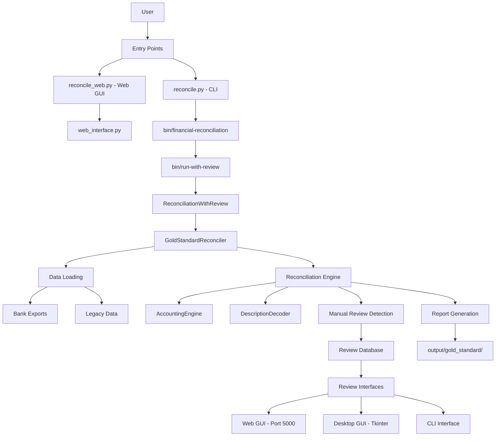

# Financial Reconciliation System Pipeline

## Overview

The Financial Reconciliation System follows a clear pipeline from data ingestion through reconciliation to final reporting. This document describes the complete flow and all entry points.

## Main Pipeline Flow



## Entry Points

### 1. Web Interface (Recommended)
```bash
python reconcile_web.py
```
- Opens Gold Standard Web GUI at http://localhost:5000
- Features glassmorphism design with real-time progress tracking
- Mobile-responsive with dark/light mode support

### 2. Command Line Interface
```bash
python reconcile.py [options]
```
- Runs full reconciliation pipeline
- Options: `--mode`, `--start-date`, `--end-date`

### 3. Direct Reconciliation Script
```bash
python bin/run-with-review
```
- Runs reconciliation with integrated manual review workflow

## Core Components

### 1. Data Loading Stage
- **Location**: `test-data/`
- **Bank Exports**: `test-data/bank-exports/` (Phase 5+ data)
- **Legacy Data**: `test-data/legacy/` (Pre-reviewed Phase 4 data)
- **Loaders**: `src/loaders/` (expense, rent, zelle loaders)

### 2. Reconciliation Engine
- **Main Class**: `GoldStandardReconciler` in `src/core/reconciliation_engine.py`
- **Modes**:
  - `FROM_SCRATCH`: Processes all transactions from $0
  - `FROM_BASELINE`: Starts from known balance (recommended)
- **Features**:
  - Double-entry bookkeeping via `AccountingEngine`
  - Transaction pattern recognition via `DescriptionDecoder`
  - Data quality checks and validation

### 3. Manual Review System
- **Database**: `data/phase5_manual_reviews.db` (SQLite)
- **Detection**: Flags ambiguous transactions during reconciliation
- **Review Interfaces**:
  - Web GUI: `src/review/web_interface.py` (Flask app)
  - Desktop GUI: `src/review/modern_visual_review_gui.py`
  - CLI: `src/review/manual_review_system.py`

### 4. Output Generation
- **Directory**: `archive/output/gold_standard/` (archived results)
- **Live Directory**: Results are generated and then archived automatically
- **Files Generated**:
  - `accounting_ledger.csv` - Complete transaction ledger
  - `audit_trail.csv` - Detailed audit log
  - `data_quality_issues.csv` - Flagged data problems
  - `manual_review_required.csv` - Transactions needing review
  - `reconciliation_report.txt` - Summary report
  - `summary.json` - Machine-readable summary

## Process Flow

### Step 1: Initialize Reconciliation
```python
# From bin/run-with-review
system = ReconciliationWithReview()
reconciler = system.run_initial_reconciliation(
    mode=ReconciliationMode.FROM_BASELINE,
    baseline_date=datetime(2024, 9, 30),
    baseline_amount=Decimal('1577.08'),
    baseline_who_owes='Jordyn owes Ryan'
)
```

### Step 2: Load and Process Data
- Loads bank exports for specified date range
- Normalizes data formats across different banks
- Applies data quality checks
- Processes transactions through accounting engine

### Step 3: Flag Manual Review Items
- Identifies ambiguous transactions
- Exports to manual review database
- Prompts user to review via chosen interface

### Step 4: Apply Reviews and Finalize
- Loads completed manual reviews
- Re-runs reconciliation with review decisions
- Validates accounting invariants
- Generates comprehensive reports

## Configuration

### Main Configuration File
- **Location**: `config/config.yaml`
- **Settings**: Tolerances, thresholds, data quality rules

### Environment Variables
- `FLASK_PORT`: Web GUI port (default: 5000)
- `REVIEW_DB_PATH`: Manual review database location

## Testing the Pipeline

### Run Full Pipeline Test
```bash
# Test with sample data
python reconcile.py --mode from_baseline \
    --start-date 2024-10-01 \
    --end-date 2024-10-31
```

### Test Individual Components
```bash
# Test reconciliation engine
python -m pytest tests/unit/test_gold_standard.py

# Test manual review system
python -m pytest tests/unit/test_manual_review.py

# Test web interface
python -m pytest tests/integration/test_modern_gui.py
```

## Maintenance Notes

### Adding New Bank Support
1. Create loader in `src/loaders/`
2. Add bank format detection in `data_loader.py`
3. Update reconciliation engine to handle bank-specific quirks
4. Add test cases in `tests/unit/`

### Modifying Review Workflow
1. Update `ManualReviewSystem` in `src/review/manual_review_system.py`
2. Modify review interfaces as needed
3. Update database schema if required
4. Test thoroughly with sample data

---

**Last Updated**: August 2025  
**Version**: 4.0.0 Gold Standard